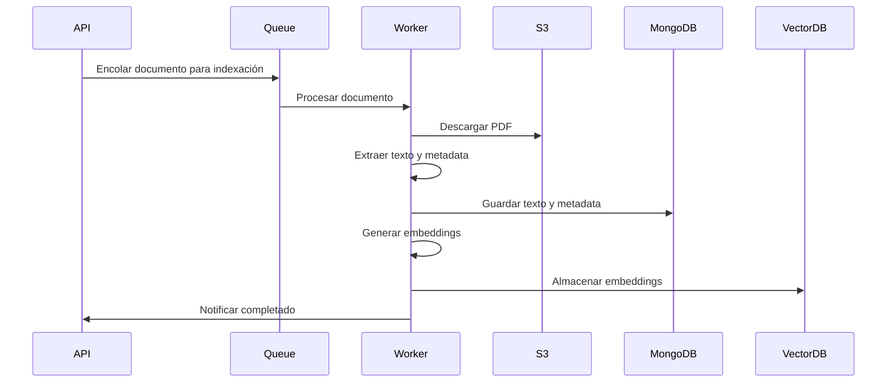
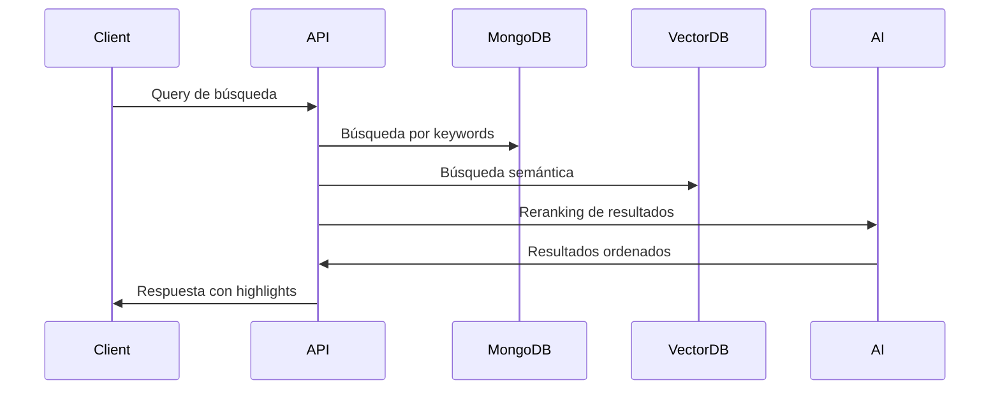

  # Diseño de API para Búsqueda Inteligente en Documentos PDF

## Resumen Ejecutivo

Este documento presenta el diseño de una API RESTful para realizar búsquedas avanzadas dentro de documentos PDF asociados a movimientos judiciales. La arquitectura está diseñada para ser escalable y permitir la integración futura de capacidades de inteligencia artificial.

## Arquitectura del Sistema

### Componentes Principales

```
┌─────────────────┐     ┌──────────────────┐     ┌─────────────────┐
│   Frontend      │────▶│    API Gateway   │────▶│  Microservicio  │
│  (Cliente Web)  │     │   (Express.js)   │     │   Búsqueda PDF  │
└─────────────────┘     └──────────────────┘     └─────────────────┘
                                │                          │
                                │                          ▼
                        ┌───────▼────────┐        ┌─────────────────┐
                        │   MongoDB       │        │  Almacenamiento │
                        │  (Metadatos)    │        │   Objetos S3    │
                        └────────────────┘        │     (PDFs)      │
                                                  └─────────────────┘
                                                           │
                                                           ▼
                                                  ┌─────────────────┐
                                                  │   Servicio de   │
                                                  │  Procesamiento  │
                                                  │      PDF        │
                                                  └─────────────────┘
                                                           │
                                                           ▼
                                                  ┌─────────────────┐
                                                  │  Vector Store   │
                                                  │  (Embeddings)   │
                                                  └─────────────────┘
```

### Stack Tecnológico

- **Backend Framework**: Node.js + Express.js
- **Base de Datos Principal**: MongoDB (metadatos y referencias)
- **Almacenamiento de Documentos**: AWS S3 o compatible
- **Base de Datos Vectorial**: Pinecone/Weaviate/Qdrant
- **Procesamiento PDF**: pdf-parse, pdfjs-dist
- **Queue System**: Bull/RabbitMQ para procesamiento asíncrono
- **Cache**: Redis para resultados frecuentes
- **AI/ML**: OpenAI API, Anthropic Claude, o modelos locales (Ollama)

## Diseño de la API

### Endpoints Principales

#### 1. Indexación de Documentos

```typescript
POST /api/v1/documents/index
Authorization: Bearer {token}
Content-Type: application/json

{
  "causaId": "string",
  "movimientoId": "string",
  "pdfUrl": "string",
  "fuero": "CIV|CSS|CNT",
  "metadata": {
    "fecha": "ISO8601",
    "tipo": "string",
    "juzgado": "string"
  }
}

Response:
{
  "success": true,
  "data": {
    "documentId": "string",
    "status": "queued|processing|completed|failed",
    "jobId": "string"
  }
}
```

#### 2. Búsqueda Simple en Documentos

```typescript
GET /api/v1/search/documents
Authorization: Bearer {token}

Query Parameters:
- q: string (required) - Texto a buscar
- fuero: string - Filtrar por tipo de fuero
- causaId: string - Filtrar por causa específica
- dateFrom: ISO8601 - Fecha inicial
- dateTo: ISO8601 - Fecha final
- page: number (default: 1)
- limit: number (default: 20)

Response:
{
  "success": true,
  "data": {
    "results": [
      {
        "documentId": "string",
        "causaId": "string",
        "movimientoId": "string",
        "score": number,
        "highlights": [
          {
            "text": "string",
            "page": number,
            "position": {
              "start": number,
              "end": number
            }
          }
        ],
        "metadata": {
          "fecha": "ISO8601",
          "tipo": "string",
          "caratula": "string"
        }
      }
    ],
    "pagination": {
      "total": number,
      "page": number,
      "totalPages": number,
      "hasNext": boolean
    }
  }
}
```

#### 3. Búsqueda Semántica Avanzada

```typescript
POST /api/v1/search/semantic
Authorization: Bearer {token}
Content-Type: application/json

{
  "query": "string",
  "filters": {
    "fuero": ["CIV", "CSS"],
    "dateRange": {
      "from": "ISO8601",
      "to": "ISO8601"
    },
    "documentTypes": ["sentencia", "auto"]
  },
  "options": {
    "semanticSearch": true,
    "rerank": true,
    "maxResults": 50,
    "minScore": 0.7
  }
}

Response:
{
  "success": true,
  "data": {
    "results": [
      {
        "documentId": "string",
        "relevanceScore": number,
        "semanticScore": number,
        "excerpt": "string",
        "context": {
          "before": "string",
          "match": "string",
          "after": "string"
        },
        "explanation": "string" // AI-generated relevance explanation
      }
    ],
    "aggregations": {
      "byType": {},
      "byJuzgado": {},
      "timeline": []
    }
  }
}
```

#### 4. Análisis de Documento con IA

```typescript
POST /api/v1/documents/{documentId}/analyze
Authorization: Bearer {token}
Content-Type: application/json

{
  "analysisType": "summary|entities|timeline|legal-points",
  "options": {
    "language": "es",
    "detail": "brief|detailed",
    "focus": ["string"] // aspectos específicos a analizar
  }
}

Response:
{
  "success": true,
  "data": {
    "documentId": "string",
    "analysis": {
      "summary": "string",
      "entities": [
        {
          "type": "person|organization|date|monetary",
          "value": "string",
          "context": "string",
          "confidence": number
        }
      ],
      "legalPoints": [
        {
          "point": "string",
          "relevance": "high|medium|low",
          "articles": ["string"]
        }
      ],
      "timeline": [
        {
          "date": "ISO8601",
          "event": "string",
          "importance": number
        }
      ]
    },
    "metadata": {
      "processedAt": "ISO8601",
      "modelUsed": "string",
      "tokensUsed": number
    }
  }
}
```

#### 5. Búsqueda Conversacional

```typescript
POST /api/v1/search/conversational
Authorization: Bearer {token}
Content-Type: application/json

{
  "message": "string",
  "conversationId": "string", // opcional para mantener contexto
  "context": {
    "causaId": "string",
    "previousResults": ["documentId"]
  }
}

Response:
{
  "success": true,
  "data": {
    "conversationId": "string",
    "response": "string",
    "sources": [
      {
        "documentId": "string",
        "excerpt": "string",
        "page": number,
        "confidence": number
      }
    ],
    "suggestedQuestions": ["string"]
  }
}
```

### Modelos de Datos

#### Documento Indexado

```typescript
interface IndexedDocument {
  _id: ObjectId;
  documentId: string;
  causaId: string;
  movimientoId: string;
  fuero: 'CIV' | 'CSS' | 'CNT';
  
  content: {
    fullText: string;
    pages: Array<{
      pageNumber: number;
      text: string;
      bbox?: BoundingBox[];
    }>;
  };
  
  metadata: {
    fecha: Date;
    tipo: string;
    juzgado: string;
    caratula: string;
    fileSize: number;
    pageCount: number;
    language: string;
  };
  
  processing: {
    status: 'pending' | 'processing' | 'completed' | 'failed';
    indexedAt: Date;
    lastUpdated: Date;
    version: string;
    errors?: string[];
  };
  
  embeddings?: {
    model: string;
    chunks: Array<{
      text: string;
      vector: number[];
      metadata: object;
    }>;
  };
}
```

## Flujo de Procesamiento

### 1. Indexación de Nuevos Documentos



### 2. Búsqueda Híbrida



## Características Avanzadas

### 1. Sistema de Caché Inteligente

```typescript
interface CacheStrategy {
  // Caché de resultados frecuentes
  frequentQueries: {
    ttl: 3600, // 1 hora
    maxSize: 1000
  };
  
  // Caché de embeddings
  embeddingCache: {
    ttl: 86400 * 7, // 7 días
    storage: 'redis'
  };
  
  // Invalidación inteligente
  invalidation: {
    onDocumentUpdate: true,
    onNewDocument: 'partial'
  };
}
```

### 2. Pipeline de Procesamiento ML

```typescript
interface ProcessingPipeline {
  stages: [
    {
      name: 'text-extraction',
      processor: 'pdf-parse',
      config: { preserveLayout: true }
    },
    {
      name: 'ocr-fallback',
      processor: 'tesseract',
      condition: 'lowTextDensity'
    },
    {
      name: 'chunking',
      processor: 'semantic-chunker',
      config: { 
        maxChunkSize: 1000,
        overlap: 200 
      }
    },
    {
      name: 'embedding',
      processor: 'openai-ada-002',
      config: { batchSize: 100 }
    }
  ]
}
```

### 3. Métricas y Monitoreo

```typescript
interface SearchMetrics {
  performance: {
    avgResponseTime: number;
    p95ResponseTime: number;
    throughput: number;
  };
  
  quality: {
    clickThroughRate: number;
    avgRelevanceScore: number;
    userFeedbackScore: number;
  };
  
  usage: {
    dailySearches: number;
    uniqueUsers: number;
    topQueries: Query[];
  };
}
```

## Seguridad y Privacidad

### 1. Control de Acceso

- Autenticación JWT obligatoria
- Roles y permisos granulares
- Rate limiting por usuario/IP
- Auditoría de acceso a documentos sensibles

### 2. Privacidad de Datos

- Encriptación en tránsito (TLS 1.3)
- Encriptación en reposo para PDFs
- Anonimización de datos personales en logs
- Cumplimiento con normativas locales

### 3. Gestión de API Keys

```typescript
interface APIKeyManagement {
  scopes: ['read', 'write', 'analyze'];
  rateLimit: {
    requests: 1000,
    period: '1h'
  };
  restrictions: {
    ipWhitelist?: string[];
    allowedDomains?: string[];
  };
}
```

## Roadmap de Implementación

### Fase 1: MVP (2-3 meses)
- ✓ Indexación básica de PDFs
- ✓ Búsqueda por palabras clave
- ✓ API REST básica
- ✓ Autenticación y autorización

### Fase 2: Búsqueda Avanzada (2-3 meses)
- Búsqueda semántica con embeddings
- Procesamiento OCR para PDFs escaneados
- Cache y optimización de performance
- Dashboard de métricas

### Fase 3: Inteligencia Artificial (3-4 meses)
- Análisis automático de documentos
- Búsqueda conversacional
- Extracción de entidades legales
- Generación de resúmenes

### Fase 4: Escalabilidad (2-3 meses)
- Arquitectura de microservicios completa
- Procesamiento distribuido
- Multi-tenancy
- APIs públicas y SDK

## Consideraciones de Escalabilidad

### 1. Estrategia de Sharding

```typescript
interface ShardingStrategy {
  documents: {
    key: 'causaId',
    distribution: 'hash'
  };
  
  vectors: {
    key: 'embedding_cluster',
    distribution: 'range'
  };
}
```

### 2. Procesamiento Asíncrono

- Uso de colas para procesamiento pesado
- Workers escalables horizontalmente
- Priorización de trabajos por importancia
- Reintentos automáticos con backoff

### 3. Optimización de Búsquedas

- Índices compuestos en MongoDB
- Particionamiento de datos históricos
- Materialización de vistas frecuentes
- Búsqueda federada entre múltiples fuentes

## Integración con AI

### 1. Modelos Soportados

```typescript
interface AIModels {
  embedding: {
    primary: 'openai/text-embedding-3-small',
    fallback: 'sentence-transformers/all-MiniLM-L6-v2'
  };
  
  analysis: {
    primary: 'anthropic/claude-3-haiku',
    fallback: 'openai/gpt-3.5-turbo'
  };
  
  localModels: {
    enabled: true,
    provider: 'ollama',
    models: ['llama3', 'mistral']
  };
}
```

### 2. Prompts Especializados

```typescript
const LEGAL_ANALYSIS_PROMPT = `
Analiza el siguiente documento legal y extrae:
1. Partes involucradas
2. Hechos principales
3. Fundamentos legales citados
4. Decisión o resolución
5. Implicaciones futuras

Documento: {document}

Responde en formato JSON estructurado.
`;
```

## Ejemplo de Uso

### Cliente JavaScript

```javascript
import { CausasSearchClient } from '@pjn/search-sdk';

const client = new CausasSearchClient({
  apiKey: process.env.PJN_API_KEY,
  baseURL: 'https://api.pjn.gob.ar/v1'
});

// Búsqueda simple
const results = await client.search({
  query: 'daños y perjuicios accidente',
  filters: {
    fuero: 'CIV',
    dateFrom: '2023-01-01'
  }
});

// Análisis con IA
const analysis = await client.analyzeDocument(documentId, {
  type: 'summary',
  options: { detail: 'detailed' }
});

// Búsqueda conversacional
const conversation = await client.startConversation();
const response = await conversation.ask(
  '¿Qué precedentes hay sobre responsabilidad civil en accidentes de tránsito?'
);
```

## Conclusión

Este diseño proporciona una base sólida para implementar un sistema de búsqueda avanzado en documentos PDF judiciales. La arquitectura modular permite comenzar con funcionalidades básicas e ir agregando capacidades más sofisticadas de manera incremental. La integración con IA abre posibilidades para análisis complejos y asistencia legal automatizada, manteniendo siempre la seguridad y privacidad como prioridades fundamentales.